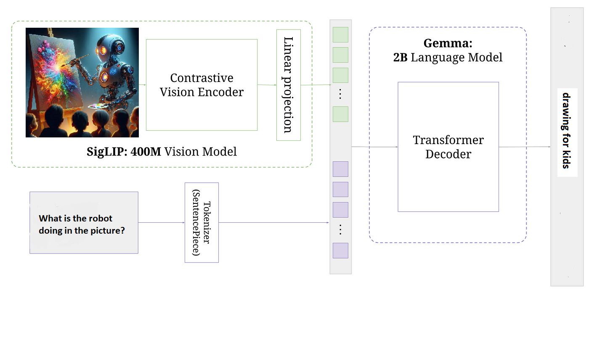
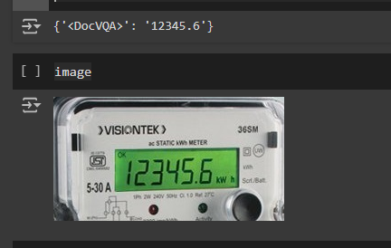
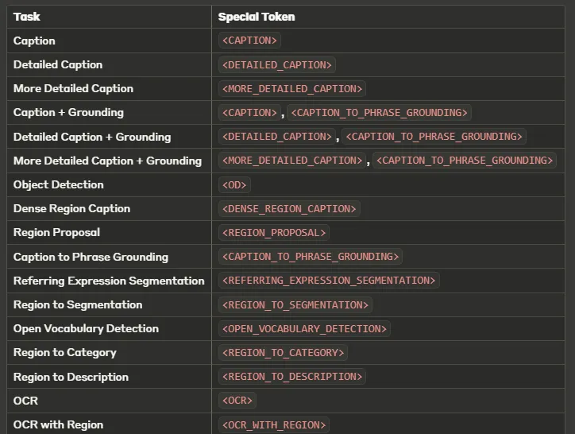

# Finetune Vision-language-models-VLM

## [Medium](https://medium.com/@elsayed_mohamed) 

vision language models  finetuning notebooks &amp; use cases
Vision Language Models (VLMs) are a cutting-edge type of artificial intelligence that combines computer vision and natural language processing. These models can understand and generate text based on visual inputs, bridging the gap between visual and textual information.

| Model | Notebook Link |
|-------|---------------|
| PaLIGemma | [pali_gemma_OCR_Meter.ipynb](https://github.com/sayedmohamedscu/Vision-language-models-VLM/blob/main/pali_gemma_OCR_Meter.ipynb) |
| Florence-2 | [Fine_tune_Florence_2_metere_values.ipynb](https://github.com/sayedmohamedscu/Vision-language-models-VLM/blob/main/Fine_tune_Florence_2_metere_values.ipynb) |

## Key Features

1. Image Understanding: VLMs can analyze and interpret complex visual scenes.
2. Text Generation: Based on visual inputs, these models can generate relevant textual descriptions or responses.
3. Multi-modal Learning: VLMs can process and correlate information from both visual and textual sources.

How VLMs Work
Vision Language Models operate through a sophisticated process that combines several key components:

Image Encoder: The first step involves encoding the input image into a latent space representation. This is typically done using advanced image encoding models such as CLIP (Contrastive Language-Image Pre-training), SigLIP (Signal-based Language-Image Pre-training), PaLI (Pathways Language and Image model), or DINO (Self-Distillation with No Labels). These encoders transform the raw pixel data into a compact, high-dimensional vector that captures the image's salient features.
Latent Space Projection: The latent space representation from the image encoder needs to be aligned with the text embedding space. This is achieved through a projection layer, which is essentially an Artificial Neural Network (ANN). This projector maps the image embeddings to a space that is compatible with text embeddings.

Text Embedding Merger: Once the image embeddings are projected into the appropriate space, they are merged with the text embeddings. This process allows the model to create a unified representation that combines both visual and textual information.

Language Model: The merged embeddings are then processed by a language model, which can generate text based on the combined visual and textual input.

This architecture allows VLMs to perform tasks such as image captioning, visual question answering, and even generating text that is contextually relevant to both images and text prompts.

## Applications

VLMs have a wide range of applications, including:

- Image captioning
- Visual question answering
- Object detection and recognition
- Scene understanding
- Assistive technologies for visually impaired individuals

## Examples

## Example1 PaliGemma Finetuning

### Electronic Meter Reading

In this image, a VLM could be trained to read the Meter values using henrik-dra/energy-meter dataset:
- Recognize the type of meter
- Read and interpret the digital display

## Example1 Florence2 Finetuning

### Electronic Meter Reading (same dataset)

Florence-2 could be used with multiple otrher applications like detection , segmnenation ,OCR , OCR with bbox and image captionating.

Here are the Florence-2 tasks 

